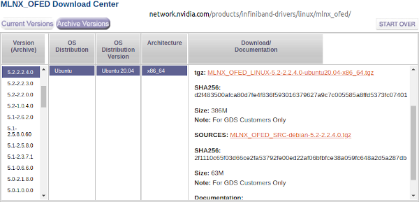
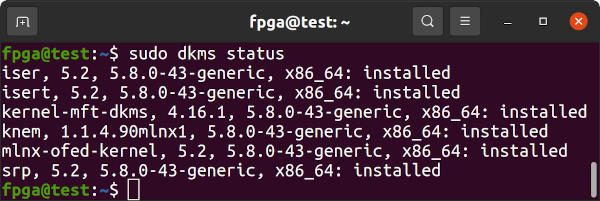
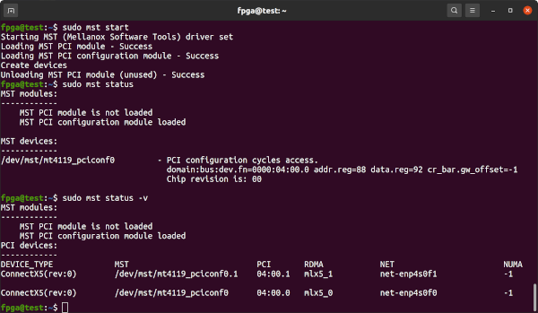
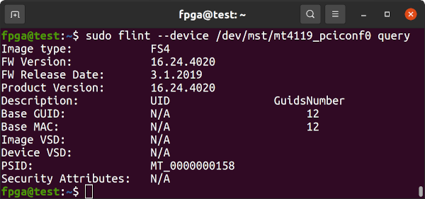
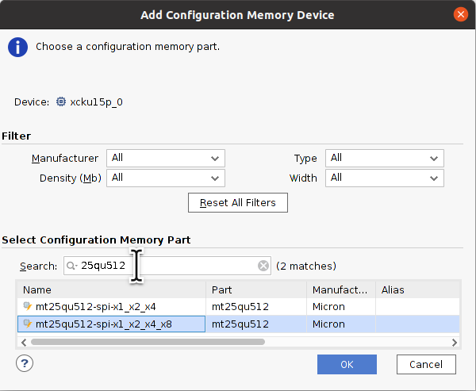
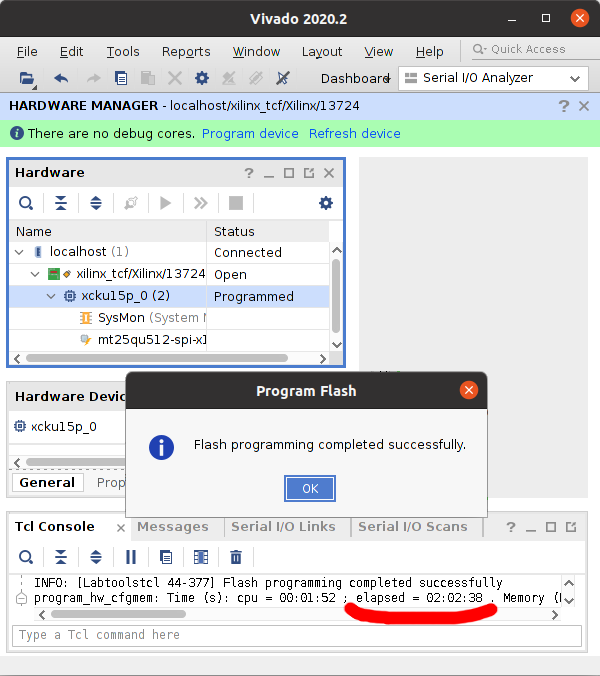
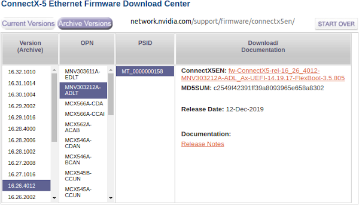
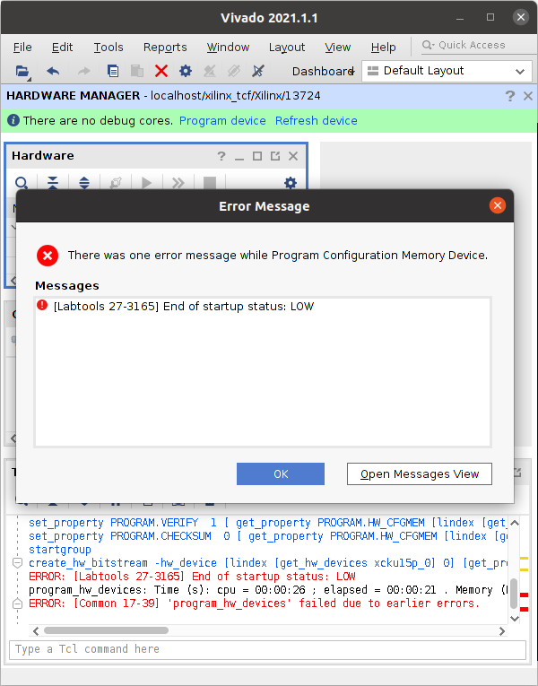
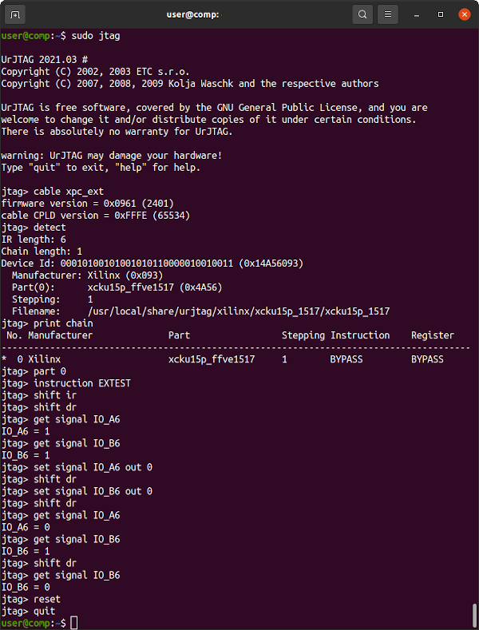

# Innova-2 Flex XCKU15P Setup and Usage Notes

The [Nvidia Mellanox Innova-2 Flex Open Programmable SmartNIC](https://www.nvidia.com/en-us/networking/ethernet/innova-2-flex/) accelerator card, model [MNV303212A-ADLT](https://www.mellanox.com/files/doc-2020/pb-innova-2-flex.pdf), can be used as an FPGA development platform. It is based on the Mellanox [ConnectX-5 MT27808](https://web.archive.org/web/20220412010542/https://network.nvidia.com/files/doc-2020/pb-connectx-5-en-ic.pdf) and Xilinx [Ultrascale+ XCKU15P](https://www.xilinx.com/products/silicon-devices/fpga/kintex-ultrascale-plus.html). It is a high capacity FPGA with 8GB DDR4, connected through a PCIe x8 bridge in the ConnectX-5. Its capabilities are between that of an [Alveo U25N](https://www.xilinx.com/products/boards-and-kits/alveo/u25n.html#overview) and the [Alveo U55C](https://www.xilinx.com/products/boards-and-kits/alveo/u55c.html). Also known as the [Lenovo IBM 4XC7A16683](http://lenovopress.com/lp1169.pdf).


# Table of Contents

   * [Required Materials](#required-materials)
   * [Cooling Solution](#cooling-solution)
   * [System Setup](#system-setup)
      * [Linux Kernel](#linux-kernel)
         * [GRUB Bootloader Configuration](#grub-bootloader-configuration)
         * [Remove all Kernels other than 5.8.0-43](#remove-all-kernels-other-than-580-43)
      * [Install All Prerequisites](#install-all-prerequisites)
      * [Install Mellanox OFED](#install-mellanox-ofed)
      * [Install Xilinx PCIe DMA IP Drivers](#install-xilinx-pcie-dma-ip-drivers)
         * [Install and Set Up DPDK](#install-and-set-up-dpdk)
         * [Generate Personal Signing Key](#generate-personal-signing-key)
         * [Build and Install Xilinx XDMA Drivers](#build-and-install-xilinx-xdma-drivers)
      * [Set up Innova-2 Flex Application](#set-up-innova-2-flex-application)
      * [Install Vivado or Vivado Lab Edition](#install-vivado-or-vivado-lab-edition)
   * [Test the Innova-2](#test-the-innova-2)
      * [Innova-2 ConnectX-5 Firmware](#innova-2-connectx-5-firmware)
         * [Programming the ConnectX5 Firmware FLASH IC Directly](#programming-the-connectx5-firmware-flash-ic-directly)
      * [Testing The Network Ports](#testing-the-network-ports)
   * [Programming the FPGA](#programming-the-fpga)
      * [Initial Loading of the Flex Image](#initial-loading-of-the-flex-image)
         * [Generate Configuration Images for the Full Memory Array](#generate-configuration-images-for-the-full-memory-array)
         * [Enable JTAG Access to the XCKU15P](#enable-jtag-access-to-the-xcku15p)
         * [Programming the Factory and Flex Images](#programming-the-factory-and-flex-images)
      * [Loading a User Image](#loading-a-user-image)
      * [Testing a Loaded User Image](#testing-a-loaded-user-image)
   * [Upgrading the ConnectX5 Firmware](#upgrading-the-connectx5-firmware)
   * [Useful Links](#useful-links)
   * [Projects Tested to Work with the Innova2](#projects-tested-to-work-with-the-innova2)
   * [Troubleshooting](#troubleshooting)
      * [W25Q128JVS FLASH Failure](#w25q128jvs-flash-failure)
      * [Factory Image Running with Flex Image Scheduled](#factory-image-running-with-flex-image-scheduled)
      * [DDR4 Communication Error](#ddr4-communication-error)
      * [JTAG Programming Failure](#jtag-programming-failure)
      * [Board Works But Not JTAG](#board-works-but-not-jtag)
      * [Nothing Seems to Work](#nothing-seems-to-work)
      * [Disable or Enable Above-4G Memory Decoding](#disable-or-enable-above-4g-memory-decoding)
   * [JTAG Using UrJTAG](#jtag-using-urjtag)
      * [Compile and Install UrJTAG](#compile-and-install-urjtag)
      * [Create UrJTAG-Compatible JTAG Definition Files from BSDL Files](#create-urjtag-compatible-jtag-definition-files-from-bsdl-files)
      * [Add XCKU15P FFVE1517 JTAG Bit Definitions to UrJTAG](#add-xcku15p-ffve1517-jtag-bit-definitions-to-urjtag)
      * [Connect JTAG Adapter](#connect-jtag-adapter)
         * [Disconnect the Innova-2 FPGA from the PCIe Bridge](#disconnect-the-innova-2-fpga-from-the-pcie-bridge)
         * [Allow Vivado to Update Platform Cable USB II Firmware](#allow-vivado-to-update-platform-cable-usb-ii-firmware)
         * [Begin a UrJTAG Session](#begin-a-urjtag-session)


## Required Materials

* Innova-2 Flex
* Computer with 16GB+ of RAM (preferably 32GB+ and a CPU with Integrated Graphics)
* Cooling Solution (blower fan, large heatsink, thermal pads)
* **3.3V** SPI FLASH IC Programmer compatible with [flashrom](https://flashrom.org)
* Xilinx-Compatible **1.8V** [JTAG Adapter](https://www.waveshare.com/platform-cable-usb.htm)
* Second Computer or *External Powered PCIe Adapter* to program Flex and Factory Images via JTAG
* SFP28/SFP+/SFP Modules and Cable or [Direct-Attach Cable](https://www.fs.com/products/65841.html) to test network ports


## Cooling Solution

The card is designed for use in servers and requires up to 800 LFM of air flow. I run the board in an open air PC case and attached a hard drive heat sink to it and placed a 12V 1.3A blower fan from a server in line with the card. I run the blower fan from a 5V power rail and get acceptable noise and performance when using only the FPGA. I need to run the fan at 12V when testing the network interfaces. The board otherwise overheats and the interfaces shut down.


The two main ICs are different heights so I needed 2mm and 0.5mm thermal pads.


## System Setup

The Innova-2 requires a specific system setup. [Ubuntu 20.04](https://releases.ubuntu.com/20.04.4/) with Linux Kernel 5.8.0-43 and `MLNX_OFED 5.2-2.2.4.0` drivers is the most recent combination that works for me. I am running the card in the second PCIe slot of a system with 16GB of memory and a CPU with Integrated Graphics. Using the second PCIe slot prevents issues with the motherboard assuming the Innova-2 is a video card. A CPU with Integrated Graphics prevents conflicts between the Innova-2 and a Video Card and is useful when debugging PCIe designs.

I recommend starting with a fresh Ubuntu install on a blank SSD. An approximately 250GB SSD is enough for a working system that includes full *Vivado* 2021.2. 64GB drive space is enough for a working system with *Vivado Lab Edition* for basic functionality testing of the Innova-2.


### Linux Kernel

Begin by updating and upgrading your [Ubuntu 20.04](https://releases.ubuntu.com/20.04.4/) install but make sure to stay on **20.04**, no `dist-upgrade`. Run the following in a terminal. Run `sudo ls` before copy-and-pasting a large block of commands to prime `sudo` and avoid copying commands into the password field.
```Shell
sudo apt-get update  ;  sudo apt-get upgrade
sudo reboot
```

Install Linux Kernel `5.8.0-43-generic` which is the latest kernel I have found to work. It is the kernel released with Ubuntu 20.04 and appears to be the only kernel Mellanox tested against.
```Shell
sudo apt-get install   linux-buildinfo-5.8.0-43-generic \
       linux-cloud-tools-5.8.0-43-generic linux-headers-5.8.0-43-generic \
       linux-image-5.8.0-43-generic linux-modules-5.8.0-43-generic \
       linux-modules-extra-5.8.0-43-generic linux-tools-5.8.0-43-generic

sudo reboot
```

#### GRUB Bootloader Configuration

`sudo gedit /etc/default/grub` and edit GRUB's configuration to the following:

```Shell
### change timeout to 3s and add a menu
#GRUB_DEFAULT=0
GRUB_DEFAULT="Advanced options for Ubuntu>Ubuntu, with Linux 5.8.0-43-generic"
GRUB_TIMEOUT_STYLE=menu
GRUB_HIDDEN_TIMEOUT_QUIET=false
GRUB_TIMEOUT=3
GRUB_DISTRIBUTOR=`lsb_release -i -s 2> /dev/null || echo Debian`
GRUB_CMDLINE_LINUX_DEFAULT="quiet splash"
GRUB_CMDLINE_LINUX="net.ifnames=0 biosdevname=0"
```

The `net.ifnames=0 biosdevname=0` options allow default network interface names.

Update and reboot.
```Shell
sudo update-grub
sudo reboot
```

After reboot run Ubuntu *Software Updater* and reboot when it finishes.


After reboot confirm you are on kernel `5.8.0-43-generic`
```
uname -s -r -m
```


#### Remove all Kernels other than 5.8.0-43

List all installed Linux Kernels:
```Shell
dpkg -l | grep linux-image | grep "^ii"
```

Kernels `5.13.0-30-generic` and `5.13.0-52-generic` show up for me in the above command so I remove them both as they are **not** `5.8.0-43`.
```Shell
sudo apt remove \
       linux-buildinfo-5.13.0-52-generic \
       linux-cloud-tools-5.13.0-52-generic linux-headers-5.13.0-52-generic \
       linux-image-5.13.0-52-generic linux-modules-5.13.0-52-generic \
       linux-modules-extra-5.13.0-52-generic linux-tools-5.13.0-52-generic \
       \
       linux-buildinfo-5.13.0-30-generic \
       linux-cloud-tools-5.13.0-30-generic linux-headers-5.13.0-30-generic \
       linux-image-5.13.0-30-generic linux-modules-5.13.0-30-generic \
       linux-modules-extra-5.13.0-30-generic linux-tools-5.13.0-30-generic

sudo apt autoremove
sudo reboot
```


### Install All Prerequisites

Install all necessary prerequisite libraries and software. `MLNX_OFED` drivers will install custom versions of some of the libraries that get pulled into this install. By installing everything first you can avoid library incompatibility issues and `MLNX_OFED` reinstallations. `libibverbs` is one package that gets updated and pulled in by almost every piece of networking software and `MLNX_OFED` requires a custom version.
```Shell
sudo apt install    alien apt autoconf automake binfmt-support \
    binutils-riscv64-unknown-elf binwalk bison bpfcc-tools \
    build-essential bzip2 chrpath clang clinfo cmake coreutils \
    curl cycfx2prog dapl2-utils debhelper dh-autoreconf dh-python \
    dkms dos2unix doxygen dpatch dpdk elfutils flashrom flex fxload \
    gcc gcc-multilib gcc-riscv64-unknown-elf gdb gfortran \
    gfortran-multilib ghex git graphviz gtkterm gtkwave hwdata \
    ibacm ibutils ibverbs-providers ibverbs-utils intel-opencl-icd \
    iperf3 ixo-usb-jtag kcachegrind libaio1 libaio-dev libasm1 \
    libbpfcc libbpfcc-dev libbsd0 libc6 libc6-dev libcap-dev \
    libc-dev libcharon-extauth-plugins libclang-dev libcunit1 \
    libcunit1-dev libdapl2 libdrm-dev libdw1 libdwarf++0 \
    libedit-dev libegl1-mesa-dev libelf++0 libelf1 libelf-dev \
    libelfin-dev libfdt1 libfdt-dev libfontconfig1-dev \
    libfreetype6-dev libftdi1 libftdi1-dev libftdi1-doc libftdi-dev \
    libgfortran4 libglib2.0-0 libglib2.0-bin libglib2.0-data \
    libglib2.0-dev libhugetlbfs-bin libibdm1 libibmad5 libibmad-dev \
    libibnetdisc5 libibnetdisc-dev libibumad-dev libibverbs1 \
    libibverbs-dev libipsec-mb0 libipsec-mb-dev libisal2 libisal-dev \
    libjansson4 libjpeg-dev liblzma-dev libmfx1 libmfx-dev \
    libmfx-tools libmnl0 libmnl-dev libmount-dev libncurses5 \
    libncurses-dev libnl-3-200 libnl-3-dev libnl-route-3-200 \
    libnl-route-3-dev libnuma-dev libopencl-clang10 libpcap-dev \
    libprocps-dev librdmacm1 librdmacm-dev libreadline-dev \
    librte-pmd-qat20.0 libselinux1 libselinux1-dev libsgutils2-dev \
    libssl-dev libstdc++-9-dev-riscv64-cross \
    libstdc++-9-pic-riscv64-cross libstrongswan \
    libstrongswan-standard-plugins libsystemd0 libsystemd-dev \
    libtiff5 libtiff-dev libtinfo5 libtinfo-dev libtool libudev-dev \
    libunbound8 libunbound-dev libunwind8 libunwind-dev \
    libusb-1.0-0-dev libusb-dev libvma libvma-dev libxext-dev \
    libxfixes-dev libxft-dev llvm-dev logrotate lsb-base make \
    mdevctl meld mesa-opencl-icd meson module-assistant ninja-build \
    ntpdate nvme-cli ocl-icd-dev ocl-icd-libopencl1 \
    ocl-icd-opencl-dev opencl-headers openjdk-17-jdk openjdk-17-jre \
    openocd opensm openssl openvswitch-switch pandoc pciutils \
    perftest perl pkg-config procps python python3-all python3-attr \
    python3-automat python3-binwalk python3-bpfcc python3-constantly \
    python3-docutils python3-ftdi1 python3-hamcrest \
    python3-hyperlink python3-incremental python3-openssl python3-pip \
    python3-pkgconfig python3-pyasn1 python3-pyasn1-modules \
    python3-pyelftools python3-pyverbs python3-service-identity \
    python3-setuptools python3-six python3-sphinx python3-twisted \
    python3-twisted-bin python3-zope.interface python-six \
    python-zope.interface quilt rdmacm-utils sg3-utils sockperf \
    squashfs-tools squashfs-tools-ng squashfuse strongswan \
    strongswan-charon strongswan-libcharon strongswan-starter swig \
    tcl-dev tcptraceroute thermald tk-dev udev v4l2loopback-dkms \
    v4l2loopback-utils valgrind valgrind-mpi vbindiff xc3sprog \
    zlib1g zlib1g-dev dpkg-dev:i386 libgtk2.0-0:i386 libstdc++6:i386
```

Restart the system. Need to remove some extra packages that conflict with Mellanox OFED.
```Shell
sudo apt-get remove  openmpi-bin libcoarrays-openmpi-dev \
       libiscsi-bin dpdk-dev libmumps-5.2.1 librte-pmd-mlx4-20.0 \
       libsdpa-dev librte-pmd-mlx5-20.0 libcaf-openmpi-3 \
       libscotch-dev libopensm-dev libosmvendor4 libopensm8 \
       mpi-default-dev libmumps-seq-dev libopenmpi3 \
       libscalapack-openmpi2.1 libopenmpi-dev openmpi-common \
       libiscsi-dev libdpdk-dev libbibutils-dev \
       libscalapack-openmpi-dev libvma8 libfabric1 libmumps-dev \
       libbibutils6 libosmcomp4 libscalapack-mpi-dev libiscsi7 \
       mpi-default-bin

sudo apt-get update  ;  sudo apt-get upgrade
```

Install `libpng12` which is required by Vivado.
```Shell
cd ~
mkdir tmppng12
wget http://mirrors.kernel.org/ubuntu/pool/main/libp/libpng/libpng12-0_1.2.54-1ubuntu1_amd64.deb
dpkg-deb -R  libpng12-0_1.2.54-1ubuntu1_amd64.deb  tmppng12
sudo mv  tmppng12/lib/x86_64-linux-gnu/libpng12.so.0.54.0  /lib/x86_64-linux-gnu/
sudo chown root:root /lib/x86_64-linux-gnu/libpng12.so.0.54.0
sudo ln -r -s /lib/x86_64-linux-gnu/libpng12.so.0.54.0  /lib/x86_64-linux-gnu/libpng12.so.0
rm -Rf tmppng12/

sudo reboot
```

### Install Mellanox OFED

Confirm you are on kernel `5.8.0-43-generic`
```Shell
uname -s -r -m
```


`MLNX_OFED-5.2-2.2.4.0` is the latest version that works for me.



Run the following commands individually, which download and install `MLNX_OFED-5.2-2.2.4.0`.

```Shell
cd ~
wget  https://content.mellanox.com/ofed/MLNX_OFED-5.2-2.2.4.0/MLNX_OFED_LINUX-5.2-2.2.4.0-ubuntu20.04-x86_64.tgz
sha256sum  MLNX_OFED_LINUX-5.2-2.2.4.0-ubuntu20.04-x86_64.tgz
echo d2f483500afca80d7fe4f836f593016379627a9c7c005585a8ffd5373fc07401 should be the SHA256 checksum
tar -xvf  MLNX_OFED_LINUX-5.2-2.2.4.0-ubuntu20.04-x86_64.tgz
cd MLNX_OFED_LINUX-5.2-2.2.4.0-ubuntu20.04-x86_64/
sudo ./mlnxofedinstall -vvv --without-fw-update --skip-unsupported-devices-check
sudo /etc/init.d/openibd restart

sudo reboot
```


`apt-mark hold` should prevent `apt` from updating any of the packages installed by the `MLNX_OFED` drivers.
```Shell
sudo  apt-mark  hold     5.8.0-43-generic linux-image-generic \
    linux-headers-generic ofed-scripts mlnx-ofed-kernel-utils \
    mlnx-ofed-kernel-dkms iser-dkms isert-dkms srp-dkms rdma-core \
    libibverbs1 ibverbs-utils ibverbs-providers libibverbs-dev \
    libibverbs1-dbg libibumad3 libibumad-dev ibacm librdmacm1 \
    rdmacm-utils librdmacm-dev mstflint ibdump libibmad5 \
    libibmad-dev libopensm opensm opensm-doc libopensm-devel \
    libibnetdisc5 infiniband-diags mft kernel-mft-dkms perftest \
    ibutils2 ar-mgr dump-pr ibsim ibsim-doc ucx sharp hcoll \
    knem-dkms knem openmpi mpitests libdapl2 dapl2-utils \
    libdapl-dev dpcp srptools mlnx-ethtool mlnx-iproute2
```

Confirm the installed version of Mellanox OFED.
```Shell
ofed_info -n
```


### Install Xilinx PCIe DMA IP Drivers

Download and extract the March 18, 2022, commit 7859957 version of Xilinx's [DMA IP Drivers](https://github.com/Xilinx/dma_ip_drivers/tree/785995783c78b2cbec6458141c4395e204c5bd9b).
```Shell
cd ~
wget https://codeload.github.com/Xilinx/dma_ip_drivers/zip/785995783c78b2cbec6458141c4395e204c5bd9b -O dma_ip_drivers-7859957.zip
unzip dma_ip_drivers-7859957.zip
mv dma_ip_drivers-785995783c78b2cbec6458141c4395e204c5bd9b dma_ip_drivers
```

#### Install and Set Up DPDK

DPDK requires hugepages.
```Shell
sudo su
echo 1024 > /sys/kernel/mm/hugepages/hugepages-2048kB/nr_hugepages
exit
```

[DPDK](https://doc.dpdk.org/guides/linux_gsg/linux_drivers.html) v20.11.5 is the latest version that I have tested to work with Xilinx's `dma_ip_drivers 7859957`.
```Shell
cd ~
git clone --recursive -b v20.11.5 --single-branch http://dpdk.org/git/dpdk-stable
cd dpdk-stable
git checkout v20.11.5
git describe --tags
git clone git://dpdk.org/dpdk-kmods
cp -r ../dma_ip_drivers/QDMA/DPDK/drivers/net/qdma ./drivers/net/
cp -r ../dma_ip_drivers/QDMA/DPDK/examples/qdma_testapp ./examples/
echo Configure DPDK for more ethernet ports
echo "dpdk_conf.set('RTE_MAX_ETHPORTS', 256)"     >>config/meson.build
echo "dpdk_conf.set('RTE_MAX_VFIO_GROUPS', 256)"  >>config/meson.build
```

`gedit drivers/net/meson.build` and add QDMA support to your DPDK build in `drivers/net/meson.build`. After `'mlx5',` add `'qdma',`

`gedit config/rte_config.h` and search for `EAL defines` in `rte_config.h` to change/add the following values:
```C
#define RTE_MAX_MEMZONE 20480
#define RTE_MAX_VFIO_CONTAINERS 256
#define RTE_MAX_QUEUES_PER_PORT 2048
#define RTE_LIBRTE_QDMA_DEBUG_DRIVER 1
```

`gedit usertools/dpdk-devbind.py` and add Xilinx QDMA Vendor and Device IDs amongst similar vendor definitions in `usertools/dpdk-devbind.py`:
```Python
xilinx_qdma_pf = {'Class': '05', 'Vendor': '10ee',
  'Device': '9011,9111,9211, 9311,9014,9114,9214,9314,9018,9118,
  9218,9318,901f,911f,921f,931f,9021,9121,9221,9321,9024,9124,9224,
  9324,9028,9128,9228,9328,902f,912f,922f,932f,9031,9131,9231,9331,
  9034,9134,9234,9334,9038,9138,9238,9338,903f,913f,923f,933f,9041,
  9141,9241,9341,9044,9144,9244,9344,9048,9148,9248,9348',
 'SVendor': None, 'SDevice': None}

xilinx_qdma_vf = {'Class': '05', 'Vendor': '10ee',
  'Device': 'a011,a111,a211,a311,a014,a114,a214,a314,a018,a118,
  a218,a318,a01f,a11f,a21f,a31f,a021,a121,a221,a321,a024,a124,a224,
  a324,a028,a128,a228,a328,a02f,a12f,a22f,a32f,a031,a131,a231,a331,
  a034,a134,a234,a334,a038,a138,a238,a338,a03f,a13f,a23f,a33f,a041,
  a141,a241,a341,a044,a144,a244,a344,a048,a148,a248,a348',
  'SVendor': None, 'SDevice': None}
```

Change (also in `dpdk-devbind.py`)
```Python
network_devices = [network_class, cavium_pkx, avp_vnic, ifpga_class]
```
to 
```Python
network_devices = [network_class, cavium_pkx, avp_vnic, ifpga_class, xilinx_qdma_pf, xilinx_qdma_vf]
```


Build DPDK:
```Shell
cd ~/dpdk-stable
meson build
cd build
ninja
sudo ninja install
sudo ldconfig
cd ../examples/helloworld/
make
```

Confirm DPDK built correctly:
```Shell
cd build
sudo ./helloworld-shared
```
Above should produce output similar to:
```
 EAL: Detected 4 lcore(s)
 EAL: Detected 1 NUMA nodes
 EAL: Multi-process socket /var/run/dpdk/rte/mp_socket
 EAL: Selected IOVA mode 'PA'
 EAL: No available hugepages reported in hugepages-1048576kB
 EAL: Probing VFIO support...
 EAL: VFIO support initialized
 hello from core 1
 hello from core 2
 hello from core 3
 hello from core 0
```

Build `igb_uio`.
```Shell
cd ~/dpdk-stable/dpdk-kmods/linux/igb_uio
make
ls -la ~/dpdk-stable/build/drivers/  |  grep librte_net_qdma.a
```
Confirm `librte_net_qdma.a` was built and shows up above. Continue to build QDMA test application:
```Shell
cd ~/dpdk-stable/examples/qdma_testapp/
make  RTE_SDK=`pwd`/../..  RTE_TARGET=build
sudo build/qdma_testapp-shared
```
Above should produce output similar to:
```
 QDMA testapp rte eal init...
 EAL: Detected 4 lcore(s)
 EAL: Detected 1 NUMA nodes
 EAL: Multi-process socket /var/run/dpdk/rte/mp_socket
 EAL: Selected IOVA mode 'VA'
 EAL: No available hugepages reported in hugepages-2048kB
 EAL: Probing VFIO support...
 EAL: VFIO support initialized
 EAL: No legacy callbacks, legacy socket not created
 Ethernet Device Count: 0
 Logical Core Count: 4
 EAL: Error - exiting with code: 1
   Cause: No Ethernet devices found. Try updating the FPGA image.
```

#### Generate Personal Signing Key

Need a personal [signing key](https://github.com/andikleen/simple-pt/issues/8#issuecomment-813438385) for compiled kernel modules. Copy and paste the following into a command terminal and it should generate a key configuration.

```Shell
cd /lib/modules/$(uname -r)/build/certs

sudo tee x509.genkey > /dev/null << 'EOF'
[ req ]
default_bits = 4096
distinguished_name = req_distinguished_name
prompt = no
string_mask = utf8only
x509_extensions = myexts
[ req_distinguished_name ]
CN = Modules
[ myexts ]
basicConstraints=critical,CA:FALSE
keyUsage=digitalSignature
subjectKeyIdentifier=hash
authorityKeyIdentifier=keyid
EOF
```

Generate custom key and reboot.
```Shell
sudo openssl req -new -nodes -utf8 -sha512 -days 36500 -batch -x509 -config x509.genkey -outform DER -out signing_key.x509 -keyout signing_key.pem
sudo reboot
```

#### Build and Install Xilinx XDMA Drivers

```Shell
cd ~/dma_ip_drivers/XDMA/linux-kernel/xdma
make
sudo make install
sudo depmod -a
sudo reboot
```

After reboot confirm Kernel Modules are Installed.
```Shell
sudo dkms status
```




### Set up Innova-2 Flex Application

The `innova2_flex_app`, part of the [Innova-2 Flex Firmware Release](https://www.nvidia.com/en-us/networking/ethernet/innova-2-flex/), allows software update of the XCKU15P FPGA User Image as well as basic diagnostics of the Innova-2.


The following commands download and install *Innova_2_Flex_Open_18_12*.
```Shell
cd ~
wget http://www.mellanox.com/downloads/fpga/flex/Innova_2_Flex_Open_18_12.tar.gz
md5sum Innova_2_Flex_Open_18_12.tar.gz
echo fdb96d4e02de11ef32bf3007281bfa53 should be the MD5 Checksum
tar -xvf Innova_2_Flex_Open_18_12.tar.gz
cd Innova_2_Flex_Open_18_12/driver/
make
sudo depmod -a
cd ../app/
make
cd ~
```

### Install Vivado or Vivado Lab Edition

Create a symbolic link for `gmake` which Vivado requires but Ubuntu already includes as `make`.
```Shell
sudo ln -s  /usr/bin/make  /usr/bin/gmake
```

Install [Xilinx Vivado ML 2021.2](https://www.xilinx.com/support/download/index.html/content/xilinx/en/downloadNav/vivado-design-tools/2021-2.html). There are only modest savings in bandwidth and space requirements when using the Web Installer so you may as well download the complete 72GB [Xilinx Unified Installer 2021.2 SFD](https://www.xilinx.com/member/forms/download/xef.html?filename=Xilinx_Unified_2021.2_1021_0703.tar.gz) offline package. Install Vitis and check Kintex Ultrascale+ under device support.  Refer to the [Vivado Release Notes](https://www.xilinx.com/content/dam/xilinx/support/documents/sw_manuals/xilinx2021_2/ug973-vivado-release-notes-install-license.pdf) for more info.

If download size is an issue, download only **Vivado Lab Edition** for now which is enough to test the Innova-2's FPGA.

Vivado **2021.2** is the latest version which has successfully synthesized a basic DDR4 design for me. 2018.3 and 2020.2 also worked. 2021.1 and 2017.2 fail. Run the following commands individually.

```Shell
echo c6f91186f332528a7b74a6a12a759fb6 should be the MD5 Checksum Value
md5sum Xilinx_Unified_2021.2_1021_0703.tar.gz
tar -xvf Xilinx_Unified_2021.2_1021_0703.tar.gz
cd Xilinx_Xilinx_Unified_2021.2_1021_0703/
sudo ./xsetup
cd /tools/Xilinx/Vivado/2021.2/data/xicom/cable_drivers/lin64/install_script/install_drivers/
sudo ./install_drivers
```


## Test the Innova-2

Power off your system. Then plug the Innova-2 into your system and power on.

Check if it shows up in `lspci`.
```Shell
sudo lspci | grep -i mellanox
```


Start Mellanox Software Tools (`mst`) to find the Innova-2's device address. Note the `/dev/mst/mt4119_pciconf0` or similar which will be needed later.
```Shell
sudo mst start
sudo mst status
sudo mst status -v
```



### Innova-2 ConnectX-5 Firmware

Run Mellanox's Flash Interface Tool `flint` for information on the Innova-2's ConnectX-5 firmware.
```Shell
sudo mst start
sudo flint --device /dev/mst/mt4119_pciconf0 query
```


If the result is `PSID: MT_0000000158` then you can attempt to program the firmware using `flint`. Otherwise, the next step requires burning the flash IC directly using an IC programmer. My device presented as `PSID: IBM0000000018` and needed to be directly programmed. Note that `sudo mst start` must be run to enable `flint`.

Make sure to **write down the GUID and MAC values**.

If the FW Version is `16.24.4020` or newer then proceed to [Testing The Network Ports](#testing-the-network-ports) as firmware is already up-to-date.

Attempt to program the firmware using `flint`. Note that the 25GbE SFP28 MT27808A0 *MNV303212A-ADLT* with DDR4 is nicknamed *Morse* while the 100GbE QSFP MT28808A0 *MNV303611A-EDLT* is nicknamed *MorseQ* and its firmware is in `MorseQ_FW`. `cd` into the appropriate directory.
```Shell
cd ~/Innova_2_Flex_Open_18_12/FW/Morse_FW/
sudo flint --device /dev/mst/mt4119_pciconf0 --image fw-ConnectX5-rel-16_24_4020-MNV303212A-ADL_Ax.bin --allow_rom_change burn
```


If the above works, proceed to [Testing The Network Ports](#testing-the-network-ports). If it fails as above, continue to programming the FLASH IC.

#### Programming the ConnectX5 Firmware FLASH IC Directly

If your ConnectX-5 Firmware shows up as `PSID: IBM0000000018` or is too old to update with `flint` you will need to program the FLASH directly. The IC is a 3V 128Mbit=16Mbyte [W25Q128JVS](https://www.winbond.com/resource-files/W25Q128JV%20RevI%2008232021%20Plus.pdf). I was able to successfully program it using a [CH341A Programmer](https://github.com/stahir/CH341-Store). **This is a dangerous procedure that can destroy your Innova-2**. Please do not make this your first attempt at FLASH IC programming. Consider a practice run on some other less important device or purchase a W25Q128JVS IC to test with.


If you are using a CH341A Programmer, set the configuration jumper to default/SPI mode, `1-2`.


Please take [ESD precautions](https://www.dell.com/support/kbdoc/en-ca/000137973/safety-precautions-when-working-with-electrical-equipment) seriously. Connect your 3.3V programmer to the W25Q128JVS. The Innova-2 **should not** be powered or plugged in.


Confirm pin connections are independent. Note Pins 8, 7, and 3 (Vcc, Hold, and Write-Protect) are shorted together but all other pins are independent with respect to each other. Check every combination.


Confirm Programmer-to-FLASH IC connections. 1-to-1, 2-to-2, etc.


Abort if anything appears to be incorrect. If you are certain the programmer is connected properly and you accept the risks, plug the programmer into your system. The Innova-2 **should not** be powered or plugged in.


Use `flashrom` to test the CH341A-to-FLASH connection.
```Shell
sudo flashrom --programmer ch341a_spi
```


Use `flashrom` to read the contents of the FLASH IC at least twice.
```Shell
sudo flashrom --programmer ch341a_spi --read W25Q128save.bin
sudo flashrom --programmer ch341a_spi --read W25Q128save2.bin
```


Confirm FLASH IC reads are identical, similar to below.
```Shell
sha256sum W25Q128save.bin W25Q128save2.bin
```


Confirm FLASH IC reads are sensible. Notice the `ab cd ef 00 fa de 12 34 56 78 de ad` in the first line of the header.
```Shell
od -A x -t x1z -v W25Q128save.bin  |  head
```


Abort this entire procedure if the FLASH contents are not consistent and/or the header is not sensible. Something might be wrong with your programmer or its connections.

Use `flashrom` to write the latest Innova-2 firmware to the W25Q128. This takes several minutes. Note that the 25GbE SFP28 *MNV303212A-ADLT* with DDR4 is nicknamed *Morse* while the 100GbE QSFP *MNV303611A-EDLT* is nicknamed *MorseQ*. `cd` into the appropriate directory.
```Shell
cd ~/Innova_2_Flex_Open_18_12/FW/Morse_FW/
sudo flashrom --programmer ch341a_spi --write fw-ConnectX5-rel-16_24_4020-MNV303212A-ADL_Ax.bin
```


Power down your system. Wait a moment, then power back up.

Start Mellanox Software Tools (MST) and query the new firmware with `flint`.
```Shell
sudo mst start
sudo mst status
sudo mst status -v
sudo flint --device /dev/mst/mt4119_pciconf0 query
```



Notice above that the GUID and MAC IDs are blank. Use `flint` to set the values back to those from earlier.
```Shell
sudo flint --device /dev/mst/mt4119_pciconf0 -guid 0xc0dec0dec0dec0de -mac 0xc0dec0dec0de sg
sudo mlxfwreset --device /dev/mst/mt4119_pciconf0 reset
sudo flint --device /dev/mst/mt4119_pciconf0 query
```


Power down and restart your system.

### Testing The Network Ports

The network interfaces can be tested using 1G, 10G, or 25G SFP/SFP+/SFP28 modules and cables. The [ConnectX-5 MT2x808](https://web.archive.org/web/20220412010542/https://network.nvidia.com/files/doc-2020/pb-connectx-5-en-ic.pdf) supports all three speeds. Note that if you have the 100GbE QSFP *MNV303611A-EDL* variant of the Innova-2 it requires 100GbE QSFP equipment. I used a [Direct-Attach Cable](https://www.te.com/usa-en/product-2821224-7.html). [Another such cable](https://www.fs.com/products/65841.html).


Check that the cable is recognized.
```Shell
sudo mst start
sudo mst cable add
sudo mlxcables
```


The Innova-2 interfaces show up as `enp4s0f0` and `enp4s0f1` or similar.
```Shell
ip link show  |  grep enp
```


Two connected network interfaces on the same system can be tested by attaching each to its own namespace and then running `iperf3` between them.

In one terminal, set up a Server namespace and attach one of the network interfaces to it.
```Shell
sudo su
ip netns add serv
ip link set enp4s0f0 netns serv
ip netns exec serv ip addr add dev enp4s0f0 10.10.10.1/24
ip netns exec serv ip link set dev enp4s0f0 up
ip netns exec serv iperf3 -s -B 10.10.10.1
```

In a second terminal, set up a Client namespace and attach the other network interface to it. Then run `iperf3`.
```Shell
sudo su
ip netns add clnt
ip link set enp4s0f1 netns clnt
ip netns exec clnt ip addr add dev enp4s0f1 10.10.10.7/24
ip netns exec clnt ip link set dev enp4s0f1 up
ip netns exec clnt iperf3 -t 1 -c 10.10.10.1 -B 10.10.10.7
```

Results should approach about 23Gbits/sec as there is some overhead. Change the `-t 1` option to `-t 10` for longer throughput testing.


## Programming the FPGA

### Initial Loading of the Flex Image

In order for `innova2_flex_app` to program a User Image into the FPGA's configuration memory it must communicate with the Flex Image running in the FPGA. The Flex and Factory Images must get into FPGA configuration memory and reproduce the Memory Layout as pictured below. The `innova2_flex_app` is faster at programming a User Image than JTAG as the Flex Image provides a PCIe interface to the FPGA's Configuration Memory FLASH ICs. Refer to the [Innova-2 User Guide](https://docs.nvidia.com/networking/display/Innova2Flex/Using+the+Mellanox+Innova-2+Flex+Open+Bundle#UsingtheMellanoxInnova2FlexOpenBundle-FlashFormat) for more info.


#### Generate Configuration Images for the Full Memory Array

Create configuration images that span the entire memory map as in the layout pictured above. The `Innova_2_Flex_Open_18_12` package does not include configuration files with the binary images so everything gets written to address `0x00000000` which is incorrect. Create correct full memory images by copying data from the individual images into blank 64MB files. This should be done on the system running JTAG and requires a copy of [Innova_2_Flex_Open_18_12](http://www.mellanox.com/downloads/fpga/flex/Innova_2_Flex_Open_18_12.tar.gz) from earlier. Note that the configuration data is split into primary and secondary parts between the two x4 FLASH ICs to double throughput to x8.
```Shell
cd ~/Innova_2_Flex_Open_18_12/FPGA_image

ls -l ./Factory_image/morse_diagnostic_ku15p_bow_10g_v192_primary.bin
ls -l ./Flex_image/morse_diagnostic_ku15p_bow_10g_v193_primary.bin

dd if=/dev/zero of=completeimage0.bin bs=4096 count=67108864 iflag=count_bytes

dd if=./Factory_image/morse_diagnostic_ku15p_bow_10g_v192_primary.bin of=completeimage0.bin bs=4096 count=14532176 conv=notrunc iflag=count_bytes
dd if=./Flex_image/morse_diagnostic_ku15p_bow_10g_v193_primary.bin    of=completeimage0.bin bs=4096 seek=50331648 count=14382128 conv=notrunc oflag=seek_bytes iflag=count_bytes

sha256sum ./Factory_image/morse_diagnostic_ku15p_bow_10g_v192_primary.bin
dd if=completeimage0.bin bs=4096 count=14532176 iflag=count_bytes | sha256sum

sha256sum ./Flex_image/morse_diagnostic_ku15p_bow_10g_v193_primary.bin
dd if=completeimage0.bin bs=4096 skip=50331648 count=14382128 iflag=skip_bytes,count_bytes | sha256sum

ls -l ./Factory_image/morse_diagnostic_ku15p_bow_10g_v192_secondary.bin
ls -l ./Flex_image/morse_diagnostic_ku15p_bow_10g_v193_secondary.bin

dd if=/dev/zero of=completeimage1.bin bs=4096 count=67108864 iflag=count_bytes

dd if=./Factory_image/morse_diagnostic_ku15p_bow_10g_v192_secondary.bin of=completeimage1.bin bs=4096 count=14532176 conv=notrunc iflag=count_bytes
dd if=./Flex_image/morse_diagnostic_ku15p_bow_10g_v193_secondary.bin    of=completeimage1.bin bs=4096 seek=50331648 count=14382128 conv=notrunc oflag=seek_bytes iflag=count_bytes

sha256sum ./Factory_image/morse_diagnostic_ku15p_bow_10g_v192_secondary.bin
dd if=completeimage1.bin bs=4096 count=14532176 iflag=count_bytes | sha256sum

sha256sum ./Flex_image/morse_diagnostic_ku15p_bow_10g_v193_secondary.bin
dd if=completeimage1.bin bs=4096 skip=50331648 count=14382128 iflag=skip_bytes,count_bytes | sha256sum

echo d1fcfa0315c302a4a84c45abeae66bb8365757802f57e8979e5a46a593883340
sha256sum completeimage0.bin
echo bae7da6f6426445ca5a0f6eb8786a2e6c4c8b591599506b306ba109a634efedc
sha256sum completeimage1.bin
```

Confirm the memory images were generated correctly. These checksums are only valid for `Innova_2_Flex_Open_18_12.tar.gz`.
```Shell
sha256sum completeimage0.bin completeimage1.bin
```


#### Enable JTAG Access to the XCKU15P

The Innova-2's ConnectX-5 firmware and FPGA Factory/Flex Image communicate to prevent JTAG access to the FPGA Configuration Memory outside of `innova2_flex_app`. JTAG still works with the FPGA but access to the FPGA Configuration Memory is blocked by the ConnectX-5. The ConnectX-5 controls the Write-Protect pins of the MT25QU512 ICs. JTAG must be enabled in `innova2_flex_app` before continuing. Note that if your Innova-2 already has up-to-date Factory and Flex images that work with `innova2_flex_app` then proceed to [Loading User a Image](#loading-a-user-image). Otherwise, run `innova2_flex_app` and choose option `10`-enter to enable JTAG then `99`-enter to exit.
```Shell
sudo mst start
sudo mst status
sudo mst status -v
sudo flint -d /dev/mst/mt4119_pciconf0 q
cd ~/Innova_2_Flex_Open_18_12/driver/
sudo ./make_device
sudo insmod /usr/lib/modules/`uname -r`/updates/dkms/mlx5_fpga_tools.ko
lsmod | grep mlx
cd ~
sudo ~/Innova_2_Flex_Open_18_12/app/innova2_flex_app -v
```


#### Programming the Factory and Flex Images

Connect your Xilinx-Compatible **1.8V** JTAG Adapter to your Innova-2 but power the Innova-2 from a second computer or using a *Powered External PCIe Extender*. Running JTAG from the system with the Innova-2 may cause undefined behaviour. If JTAG halts the FPGA it will disappear off the PCIe bus and possibly crash Ubuntu.


Powered PCIe Riser for Graphics Card:


Start Vivado Hardware Manager. Any recent version of [Vivado Lab Edition](https://www.xilinx.com/support/download/index.html/content/xilinx/en/downloadNav/vivado-design-tools/2021-2.html) or full Vivado is enough for this task.


Start a Connection, `Open Target -> Auto Connect`


Right-click on `xcku15p_0` and select `Add Configuration Memory Device ...`


Select `mt25qu512-spi-x1_x2_x4_x8`.



Program the complete memory images.


Once programming finishes, which can take hours, power everything down and disconnect the JTAG adapter.



Reboot and run `innova2_flex_app` to **disable JTAG access**, option `1`, so that `innova2_flex_app` can program User Images. Reboot again.
```Shell
sudo mst start
sudo mst status
sudo mst status -v
sudo flint -d /dev/mst/mt4119_pciconf0 q
cd ~/Innova_2_Flex_Open_18_12/driver/
sudo ./make_device
sudo insmod /usr/lib/modules/`uname -r`/updates/dkms/mlx5_fpga_tools.ko
lsmod | grep mlx
cd ~
sudo ~/Innova_2_Flex_Open_18_12/app/innova2_flex_app -v

sudo reboot
```


### Loading a User Image

After Vivado generates a programming Bitstream, run *Write Memory Configuration File*, select *bin*, *mt25qu512_x1_x2_x4_x8*, *SPIx8*, *Load bitstream files*, and a location and name for the output binary files. The bitstream will end up, for example, in the `DESIGN_NAME/DESIGN_NAME.runs/impl_1` subdirectory as `SOMETHING.bit`. Vivado will add the `_primary.bin` and `_secondary.bin` extensions as the Innova-2 uses dual MT25QU512 FLASH ICs in x8 for high speed programming.


Before using `innova2_flex_app` for programming, **disconnect any JTAG adapter**. The Innova-2 Flex Image must be activated to allow `innova2_flex_app` to program the FPGA's Configuration Memory. Run the `innova2_flex_app` and choose option `1`-enter then `99`-enter to enable the Flex Image. Reboot your system for the change to take effect.
```
sudo mst start
cd ~/Innova_2_Flex_Open_18_12/driver/
sudo ./make_device
sudo insmod mlx5_fpga_tools

sudo ~/Innova_2_Flex_Open_18_12/app/innova2_flex_app -v
```


After rebooting, the Flex Image should be active, check with `lspci`.
```
lspci | grep -i Mellanox
```


Start MST and load FPGA Tool modules.
```Shell
cd ~
sudo mst start
sudo mst status
sudo mst status -v
sudo flint -d /dev/mst/mt4119_pciconf0 q
cd ~/Innova_2_Flex_Open_18_12/driver/
sudo ./make_device
sudo insmod /usr/lib/modules/`uname -r`/updates/dkms/mlx5_fpga_tools.ko
cd ~
```

For board testing, clone the [innova2_xcku15p_ddr4_bram_gpio](https://github.com/mwrnd/innova2_xcku15p_ddr4_bram_gpio) demo which includes bitstream binaries.
```Shell
git clone https://github.com/mwrnd/innova2_xcku15p_ddr4_bram_gpio
cd innova2_xcku15p_ddr4_bram_gpio
```

Run `innova2_flex_app` with appropriate `-b` commands to program a design. Note the `_primary.bin,0` and `_secondary.bin,1`. Choose option `6`-enter to program the design, then `7`-enter to set the User Image as active, then `99`-enter to exit.
```Shell
sudo ~/Innova_2_Flex_Open_18_12/app/innova2_flex_app -v \
  -b innova2_xcku15p_ddr4_bram_gpio_primary.bin,0       \
  -b innova2_xcku15p_ddr4_bram_gpio_secondary.bin,1
```


### Testing a Loaded User Image

After rebooting the User Image should be active. Check with `lspci`. It shows up at PCIe Bus Address `03:00` for me. Change the commands below appropriately.
```
lspci | grep -i Xilinx
sudo lspci  -s 03:00  -v
sudo lspci  -s 03:00  -vvv | grep "LnkCap\|LnkSta"
```


Run the Xilinx XDMA Test programs. The commands below generate 8kb of random data, then send it to a BRAM in the XCKU15P, then read it back and confirm the data is identical. The address used is specific to the [innova2_xcku15p_ddr4_bram_gpio](https://github.com/mwrnd/innova2_xcku15p_ddr4_bram_gpio) project. Note `h2c` is *Host-to-Card* and `c2h` is *Card-to-Host*
```Shell
cd ~/dma_ip_drivers/XDMA/linux-kernel/tools/
dd if=/dev/urandom bs=1 count=8192 of=TEST
sudo ./dma_to_device   --verbose --device /dev/xdma0_h2c_0 --address 0x200100000 --size 8192  -f    TEST
sudo ./dma_from_device --verbose --device /dev/xdma0_c2h_0 --address 0x200100000 --size 8192 --file RECV
sha256sum TEST RECV
```


Continue to the [innova2_xcku15p_ddr4_bram_gpio](https://github.com/mwrnd/innova2_xcku15p_ddr4_bram_gpio) project for further testing of the design.


## Upgrading the ConnectX5 Firmware

Once you have tested an Innova-2 using the current working firmware, consider upgrading the ConnectX-5 using the [mlxup](https://network.nvidia.com/support/firmware/mlxup-mft/) utility. Check out the [mlxup User Guide](https://docs.mellanox.com/display/MLXUPFWUTILITY). It has an `--online` option.
```
cd ~
wget https://www.mellanox.com/downloads/firmware/mlxup/4.20.0/SFX/linux_x64/mlxup
echo e9ce226ee43fb0ad0b84ecee44cf64989bdf5f1f6a99c459aae29f3a4e1ae32c should be the SHA256 checksum
sha256sum mlxup
sudo ./mlxup
```


The latest firmware [directy downloadable](http://www.mellanox.com/downloads/firmware/fw-ConnectX5-rel-16_26_4012-MNV303212A-ADL_Ax-UEFI-14.19.17-FlexBoot-3.5.805.bin.zip) from Nvidia/Mellanox is **16.26.4012**.



## Useful Links

* [Nvidia Mellanox Innova-2 Flex Open Programmable SmartNIC](https://www.nvidia.com/en-us/networking/ethernet/innova-2-flex/)
* [Mellanox OFED Drivers](https://network.nvidia.com/products/infiniband-drivers/linux/mlnx_ofed/)
* [Innova-2 Flex User Guide](https://docs.nvidia.com/networking/display/Innova2Flex)
* [Lenovo Innova-2 Product Page](https://lenovopress.lenovo.com/lp1169-thinksystem-mellanox-innova-2-connectx-5-fpga-25gbe-2-port-adapter)
* [Lenovo Version of User Guide](https://download.lenovo.com/servers/mig/2019/05/15/20295/mlnx-lnvgy_utl_nic_in2-18.12_manual_2.0.pdf)
* [Original Constraints XDC File](https://docs.nvidia.com/networking/download/attachments/11995849/Verilog_VHDL_and_Xilinx_Design_Constrains.zip?version=3&modificationDate=1554374888353&api=v2)
* [OpenCAPI Presentation](https://opencapi.org/wp-content/uploads/2018/12/OpenCAPI-Tech-SC18-Exhibitor-Forum.pdf)
* [OpenCAPI3.0 Reference Design](https://github.com/OpenCAPI/OpenCAPI3.0_Client_RefDesign/wiki)
* [OpenCAPI Pinout](https://docs.nvidia.com/networking/download/attachments/11995849/Innova-2%20Flex%20Open%20Interface%20Pinouts.xlsx?version=2&modificationDate=1554362542493&api=v2)
* OpenCAPI [OpenPower Advanced Accelerator Adapter Electro-Mechanical Specification](https://files.openpower.foundation/s/xSQPe6ypoakKQdq/download/25Gbps-spec-20171108.pdf)
* OpenCAPI [SlimSAS Connector U10-J074-24 or U10-K274-26](https://www.amphenol-cs.com/media/wysiwyg/files/documentation/datasheet/inputoutput/hsio_cn_slimsas_u10.pdf)
* [SlimSAS Cable SFF-8654 8i 85-Ohm](https://www.sfpcables.com/24g-internal-slimsas-sff-8654-to-sff-8654-8i-cable-straight-to-90-degree-left-angle-8x-12-sas-4-0-85-ohm-0-5-1-meter) or [RSL74-0540](http://www.amphenol-ast.com/v3/en/product_view.aspx?id=235) or [8ES8-1DF21-0.50](https://www.3m.com/3M/en_US/p/d/b5000000278/), [8ES8-1DF Datasheet](https://multimedia.3m.com/mws/media/1398233O/3m-slimline-twin-ax-assembly-sff-8654-x8-30awg-78-5100-2665-8.pdf)
* DDR4 x16 Twin Die Memory ICS are [MT40A1G16KNR-075](https://media-www.micron.com/-/media/client/global/documents/products/data-sheet/dram/ddr4/ddr4_16gb_x16_1cs_twindie.pdf?rev=a7b695ebf7a4498fb40244f2afd6b512) with **D9WFR** [FBGA Code](https://www.micron.com/support/tools-and-utilities/fbga?fbga=D9WFR#pnlFBGA)
* Consider [hugepages](https://wiki.debian.org/Hugepages) support from the [Linux Kernel](https://www.kernel.org/doc/Documentation/vm/hugetlbpage.txt) on server class systems with 64GB+ of RAM
* [Mipsology's Zebra AI Accelerator](https://web.archive.org/web/20220706190619/https://www.globenewswire.com/en/news-release/2018/11/08/1648425/0/en/Mipsology-Delivers-Deep-Learning-Inference-at-20X-Speedup-versus-Midrange-Xeon-CPU-Leveraging-Mellanox-SmartNIC-Adapters.html) used to be based on the Innova-2
* [Nvidia Networking](https://developer.nvidia.com/networking/ethernet-adapters) has the [FlexDriver](https://marksilberstein.com/wp-content/uploads/2021/11/asplos22main-p1364-p-6beb5fa88e-55324-final.pdf) project which can supposedly do direct NIC-to-FPGA Bump-In-The-Wire processing. How?
* [Vivado 2021.2 Developer AMI](https://aws.amazon.com/marketplace/pp/prodview-53u3edtjtp2fe) for full licensed access to Vivado
* [ServeTheHome Forum](https://forums.servethehome.com/index.php?threads/mellanox-innova2-connect-x-5-25gbps-sfp28-and-xilinx-kintex-ultrascale-dpu-250-bestoffer.31993/) post regarding the Innova-2
* [EEVblog Forum](https://www.eevblog.com/forum/repair/how-to-test-salvageable-xilinx-ultrascale-board-from-ebay/?all) post regarding the Innova-2
* [nextpnr-xilinx](https://github.com/gatecat/nextpnr-xilinx) project as well as [prjxray](https://github.com/f4pga/prjxray) and [prjxuray](https://github.com/f4pga/prjuray)


## Projects Tested to Work with the Innova2

* [innova2_xcku15p_ddr4_bram_gpio](https://github.com/mwrnd/innova2_xcku15p_ddr4_bram_gpio) - Simple PCIe XDMA to DDR4 and GPIO Demo


## Troubleshooting

### W25Q128JVS FLASH Failure

If the PCIe Bridge partially shows up in `lspci`, the W25Q128JVS FLASH IC has failed or is written incorrectly.
```Shell
sudo lspci | grep -i mellanox
```


### Factory Image Running with Flex Image Scheduled

The *Factory Image* (FLASH IC Address `0x00000000`) is *Running* even though the *Flex Image* (FLASH IC Address `0x03000000`) is the *Scheduled* image. This implies there is a fault with the *Flex Image*, or it was overwritten, or a *User Image* was written to address `0x00000000` by mistake, instead of `0x01000000`. The Innova2 Flex App will **not** be able to program a *User Image* into the FPGA Configuration Memory.


Enable JTAG and [program the FPGA Configuration Memory to factory default](#programming-the-fpga).


### DDR4 Communication Error

If you attempt to send data to the DDR4 address but get `write file: Unknown error 512` it means DDR4 did not initialize properly. See the [Advanced Troubleshooting Notes](https://github.com/mwrnd/innova2_flex_xcku15p_notes/tree/main/Troubleshooting).
```Shell
cd ~/dma_ip_drivers/XDMA/linux-kernel/tools/
dd if=/dev/urandom bs=1 count=8192 of=TEST
sudo ./dma_to_device   --verbose --device /dev/xdma0_h2c_0 --address 0x0 --size 8192  -f    TEST
```


### JTAG Programming Failure

If Vivado finishes Configuration Memory Programming in under a minute with a *\[Labtools 27-3165\] End of startup status: Low* error, it has **not** programmed anything.



**Enable JTAG Access** before attempting JTAG programming.
```Shell
sudo mst start
sudo mst status
sudo mst status -v
sudo flint -d /dev/mst/mt4119_pciconf0 q
cd ~/Innova_2_Flex_Open_18_12/driver/
sudo ./make_device
sudo insmod /usr/lib/modules/`uname -r`/updates/dkms/mlx5_fpga_tools.ko
lsmod | grep mlx

cd ~
sudo ~/Innova_2_Flex_Open_18_12/app/innova2_flex_app -v
```


### Board Works But Not JTAG

Everything but JTAG was working so I began by trying to trace out all the JTAG connections. That went nowhere so I switched my multimeter to Diode Mode and tested all two and three terminal components. Two SC70 components marked *MXX*, U41 and U49, gave significantly different values. I replaced the part with larger readings with the same part from a different board and JTAG began working! I believe it is a [DMN63D8LW](https://www.diodes.com/assets/Datasheets/DMN63D8LW.pdf).


### Nothing Seems to Work

While testing voltages next to the SFP connectors on a powered board my multimeter lead slipped and I shorted the 12V rail. I replaced fuse F1 with a [Bel Fuse 0685P9100-01](https://belfuse.com/resources/datasheets/circuitprotection/ds-cp-0685p-series.pdf) Fast 1206 10A SMT fuse and the board was saved. I got lucky. A blown fuse is either a simple fix or a sign of catastrophic failure.


The board is well designed with all voltage rails exposed on test points. Carefully measure each one.


### Disable or Enable Above-4G Memory Decoding

It should have no effect when running a 64-Bit OS but sometimes it does. Flip this setting in your BIOS if you have any problems or throughput bandwidth seems low.


## JTAG Using UrJTAG

[UrJTAG](http://urjtag.org) is a low-level tool for communicating with JTAG devices. It supports [Xilinx Platform Cable USB II](https://docs.xilinx.com/v/u/en-US/ds593) adapters and [clones](https://www.waveshare.com/platform-cable-usb.htm). Main use is *EXTEST* pin toggling although it is theoretically possible to program the FPGA using an *SVF* file.

### Compile and Install UrJTAG

```Shell
cd ~
wget https://downloads.sourceforge.net/project/urjtag/urjtag/2021.03/urjtag-2021.03.tar.xz
sha256sum urjtag-2021.03.tar.xz
echo b0a2eaa245513af096dc4d770109832335c694c6c12aa5e92fefae8685416f1c should be the SHA256 Checksum
tar -xvf urjtag-2021.03.tar.xz
cd urjtag-2021.03/
./configure
make
sudo make install
sudo ldconfig
```

### Create UrJTAG-Compatible JTAG Definition Files from BSDL Files

Xilinx's [Kintex Ultrascale+ BSDL Files](https://www.xilinx.com/member/forms/download/sim-model-eval-license-xef.html?filename=bsdl_kintexuplus_2021_2.zip) include `STD_1149_6_2003.all` definitions that UrJTAG's `bsdl2jtag` cannot process and must therefore be removed. The included [xcku15p_ffve1517_bsd.patch](xcku15p_ffve1517_bsd.patch) is a patch to Xilinx's BSDL file for the 1517-pin XCKU15P that removes incompatible definitions. The resulting file is then processed with `bsdl2jtag` to produce the included [xcku15p_ffve1517.jtag](xcku15p_ffve1517.jtag) file.

### Add XCKU15P FFVE1517 JTAG Bit Definitions to UrJTAG

From the directory containing [xcku15p_ffve1517.jtag](xcku15p_ffve1517.jtag) run the following commands which create *PART* and *STEPPINGS* files for the XCKU15P. These commands assume UrJTAG installed support files to the default `/usr/local/share/` directory.
```Shell
sudo su
echo "# Kintex Ultrascale+ (XCKUxxP)" >>/usr/local/share/urjtag/xilinx/PARTS
echo "0100101001010110        xcku15p_1517   xcku15p_ffve1517" >>/usr/local/share/urjtag/xilinx/PARTS
mkdir /usr/local/share/urjtag/xilinx/xcku15p_1517
touch /usr/local/share/urjtag/xilinx/xcku15p_1517/STEPPINGS
echo "0000 xcku15p_1517 0" >>/usr/local/share/urjtag/xilinx/xcku15p_1517/STEPPINGS
echo "0001 xcku15p_1517 1" >>/usr/local/share/urjtag/xilinx/xcku15p_1517/STEPPINGS
cp xcku15p_ffve1517.jtag /usr/local/share/urjtag/xilinx/xcku15p_1517/xcku15p_1517
exit
```

### Connect JTAG Adapter

JTAG Communication is controlled by the ConnectX-5 on the Innova-2. Enable JTAG using `innova2_flex_app`.
```Shell
sudo mst start
sudo mst status
sudo mst status -v
sudo flint -d /dev/mst/mt4119_pciconf0 q
cd ~/Innova_2_Flex_Open_18_12/driver/
sudo ./make_device
sudo insmod /usr/lib/modules/`uname -r`/updates/dkms/mlx5_fpga_tools.ko
lsmod | grep mlx
cd ~
sudo ~/Innova_2_Flex_Open_18_12/app/innova2_flex_app -v
```


#### Disconnect the Innova-2 FPGA from the PCIe Bridge

`lspci | grep -i Mellanox` shows all connected Mellanox PCIe devices. The PCIe Bridge on the Innova-2 is device `08`, function `0`, `:08.0`. In the example below it shows up with Bus ID `02`. Disable the FPGA-to-PCIe connection so that JTAG does not interfere with the PCIe bus. Notice the `(rev ff)` on the Xilinx device after disconnection.
```Shell
sudo setpci  -s 02:08.0  0x70.w=0x50
```
It can later be re-enabled with the following command or a cold reboot.
```Shell
sudo setpci  -s 02:08.0  0x70.w=0x40
```


#### Allow Vivado to Update Platform Cable USB II Firmware

Connect your JTAG Adapter to the Innova-2. If you are using a Platform Cable USB II compatible adapter it will show up under `lsusb` as `03fd:0013 Xilinx, Inc.` In this state it cannot be used for JTAG.


Start Vivado or Vivado Lab Hardware Manager:


Connect to the JTAG Adapter (*Open Target* then *Auto Connect*) which will update the adapter's SRAM firmware. This change disappears if the JTAG adapter is powered off or unplugged from USB.


*Close Target* and exit Vivado.


`lsusb` will now show `03fd:0008 Xilinx, Inc. Platform Cable USB II`. The JTAG adapter is now ready to be used by UrJTAG.


#### Begin a UrJTAG Session

`sudo jtag` to start UrJTAG with access to USB. You should see the `jtag> ` command prompt. A [JTAG Overview](https://www.xjtag.com/about-jtag/jtag-a-technical-overview/) may be helpful before you begin.

`cable xpc_ext` selects the Xilinx Platform Cable, external JTAG chain

`detect` finds all devices in the JTAG chain

`print chain` prints all devices in the JTAG chain

`part 0` selects the first JTAG part for communication. Good practise to always make this explicit.

`instruction EXTEST` select the External Test Function

`shift ir` shifts EXTEST into the JTAG Instruction Register to put the device into EXTEST mode

`shift dr` shifts the Data Register containing all pin states into UrJTAG memory

`get signal IO_A6` displays the value of pin A6 (the inverted D19 LED) from the Data Register (1 = off)

`get signal IO_B6` displays the value of pin B6 (the inverted D18 LED) from the Data Register (1 = off)

`set signal IO_A6 out 0` sets pin A6 to output 0 in the Data Register in UrJTAG memory

`shift dr` shifts the Data Register out onto the device which should light up the D19 LED (0 = on)

`set signal IO_B6 out 0` sets pin B6 to output 0 in the Data Register in UrJTAG memory

`shift dr` shifts the Data Register out onto the device which should light up the D18 LED (0 = on)

`get signal IO_A6` displays the value of pin A6 from the last Data Register shift (0 = on)

`get signal IO_B6` displays the value of pin B6 from the last Data Register shift (1=off is an error)

`shift dr` shifts the Data Register from the device into UrJTAG memory

`get signal IO_B6` displays the value of pin B6 from the last Data Register shift (0=on is correct)

`reset` resets the JTAG chain and enters Bypass Mode

`quit` exits UrJTAG




