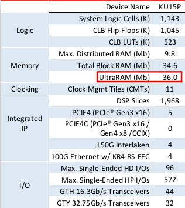
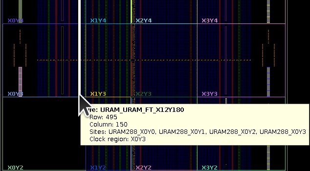
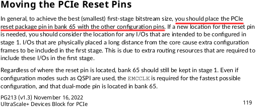
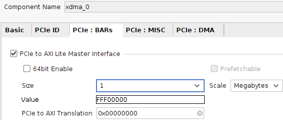
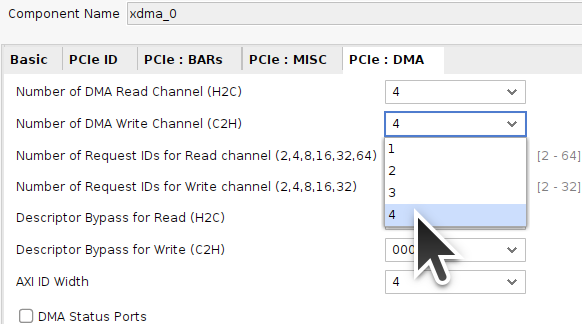
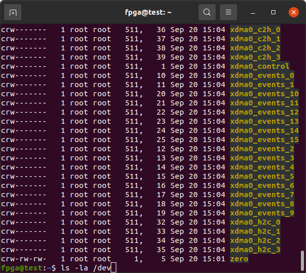

# Design Notes

## UltraRAM

The [Ultrascale+ FPGA Product Selection Guide](https://docs.xilinx.com/v/u/en-US/ultrascale-plus-fpga-product-selection-guide) lists the XCKU15P as having 36Mbit of UltraRAM:

All the UltraRAM is in a single column which can be seen when an Implemented design is opened in Vivado:

UltraRAM can be [cascaded (ug573)](https://docs.xilinx.com/v/u/en-US/ug573-ultrascale-memory-resources) and `(36000000/8/1024/1024)~=4.29` so 4MByte of range should be possible when using UltraRAM but some versions of Vivado fail implementation.

2MB of URAM running at about 220MHz is the maximal usable single URAM BRAM Block that will consistently pass implementation.

## PCIe

The PCIe Reset Pin should be in Bank65 but the Innova-2 has it in Bank90.

The PCIe-to-AXI-Lite interface has a Translation value which allows you to offset the address of connected AXI devices. For example, if your are using an MCU and its peripherals are above `0x70000000`, you can use that as the offset to allow the BAR Size (1 Megabyte below) to cover all peripheral addresses.

When you define the number of channels:

Each channel will have its own set of `h2c` and `c2h` files.

## Alternate Bitstream Programming Methods

Refer to [Post-Configuration Access of SPI Flash Memory (XAPP1280)](https://docs.xilinx.com/r/en-US/xapp1280-us-post-cnfg-flash-startupe3).

