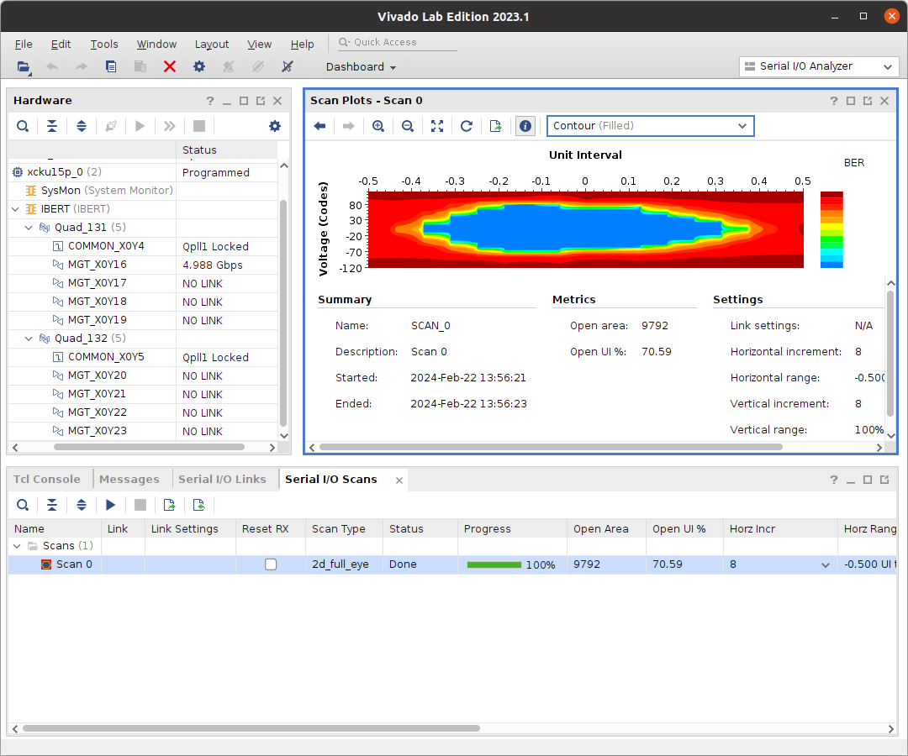
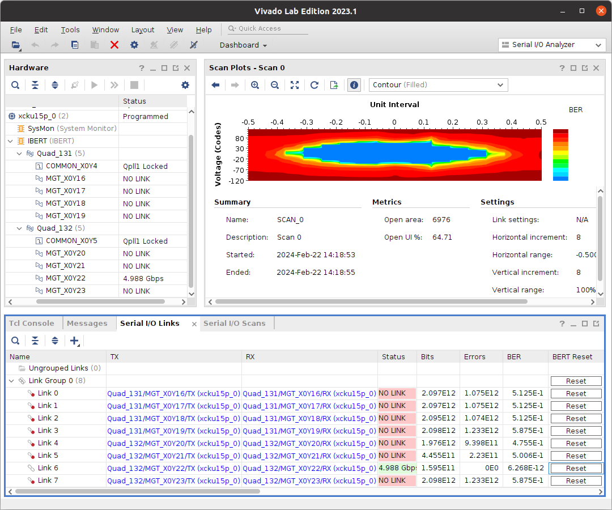
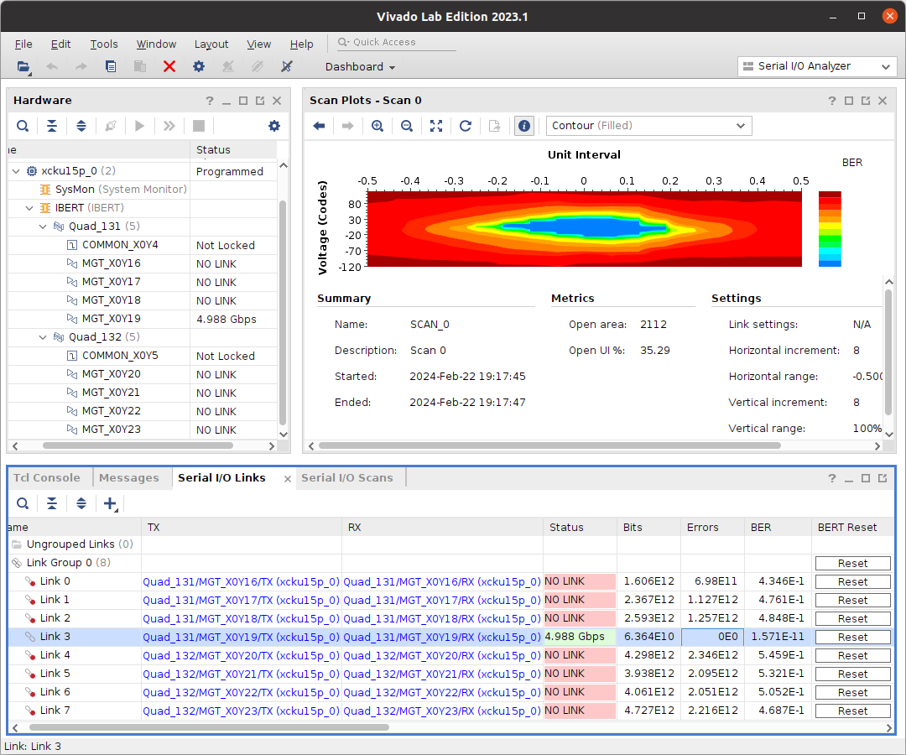

# Innova2 Hardware Notes


## Innova2 4GB MNV303212A-ADIT Hardware Notes


### Testing MNV303212A-ADIT OpenCAPI Connections

A [`v0.1-alpha` **OpenCAPI_Breakout**](https://github.com/mwrnd/OpenCAPI_Breakout/releases/tag/v0.1-alpha) board and the [IBERT for GTY](https://docs.xilinx.com/v/u/en-US/pg196-ibert-ultrascale-gty) can be used to test OpenCAPI port connections. Testing works well using a [3M 8ES8-1DF21 Cable](https://www.trustedparts.com/en/search/8ES8-1DF21)([Datasheet](https://multimedia.3m.com/mws/media/1398233O/3m-slimline-twin-ax-assembly-sff-8654-x8-30awg-78-5100-2665-8.pdf)).


A [PCIe_x8_Breakout](https://github.com/mwrnd/PCIe_x8_Breakout) in a PCIe socket was used as the source of the OpenCAPI 100MHz `GTREFCLK` clock.


I manually searched for working connections.


After finding working connections I connected both N and P signals.


I discovered that the Innova2 4GB MNV303212A-AD**I**T has a significantly different OpenCAPI pinout than the Innova2 8GB MNV303212A-AD**L**T.
```
X0Y16: RX3p-TX0n, RX3n-TX0p
X0Y17: RX0p-TX1n, RX0n-TX1p
X0Y18: RX2p-TX2p, RX2n-TX2n
X0Y20: RX4p-TX4n, RX4n-TX4p
X0Y21: RX5p-TX5p, RX5n-TX5n
X0Y22: RX6p-TX6p, RX6n-TX6n
X0Y23: RX7p-TX7p, RX7n-TX7n
```

The following are Eye Diagram Scans for all the OpenCAPI GTY Channels:

`X0Y16 RX3n-TX0p`-only:


`X0Y16 RX3p-TX0n RX3n-TX0p`:


`X0Y17 RX0p-TX1n RX0n-TX1p`:


`X0Y18 RX2p-TX2p RX2n-TX2n`:


`X0Y19 RX1p-TX3p RX1n-TX3n`:


`X0Y20 RX4p-TX4n RX4n-TX4p`:


`X0Y21 RX5p-TX5p RX5n-TX5n`:


`X0Y22 RX6p-TX6p RX6n-TX6n`:


`X0Y23 RX7p-TX7p RX7n-TX7n`:


## Innova2 8GB MNV303212A-ADLT Hardware Notes


### Testing MNV303212A-ADLT OpenCAPI Connections

A [`v0.1-alpha` **OpenCAPI_Breakout**](https://github.com/mwrnd/OpenCAPI_Breakout) board and the [IBERT for GTY project](LINKMISSING) can be used to confirm OpenCAPI port pinout and connections. Testing works well using a [3M Cable](LINKMISSING).


A [PCIe_x8_Breakout](https://github.com/mwrnd/PCIe_x8_Breakout) in a PCIe socket was used as the source of the OpenCAPI 100MHz `GTREFCLK` clock.


I manually searched for working connections.


After finding working connections I connected both N and P signals.


I discovered channels 0, 3, and 4 have swapped transceiver differential pairs (N,P):
```
RX0p-TX0n, RX0n-TX0p
RX1p-TX1p, RX1n-TX1n
RX2p-TX2p, RX2n-TX2n
RX3p-TX3n, RX3n-TX3p
RX4p-TX4n, RX4n-TX4p
RX5p-TX5p, RX5n-TX5n
RX6p-TX6p, RX6n-TX6n
RX7p-TX7p, RX7n-TX7n
```

The following are Eye Diagram Scans for all the OpenCAPI GTY Channels:

`X0Y16 RX0p-TX0n RX0n-TX0p`:



`X0Y17 RX1p-TX1p RX1n-TX1n`:


`X0Y18 RX2p-TX2p RX2n-TX2n`:


`X0Y19 RX3p-TX3n RX3n-TX3p`:


`X0Y20 RX4p-TX4n RX4n-TX4p`:


`X0Y21 RX5p-TX5p RX5n-TX5n`:


`X0Y22 RX6p-TX6p RX6n-TX6n`:



`X0Y23 RX7p-TX7p RX7n-TX7n`:


After about 15 minutes Channel X0Y19 began failing:


Results are much worse for each channel when using an SFPCables SlimSAS cable:



The PLL loses lock.


