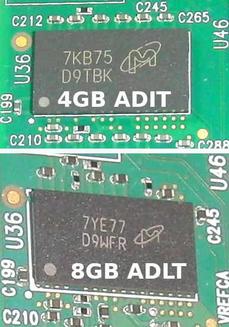
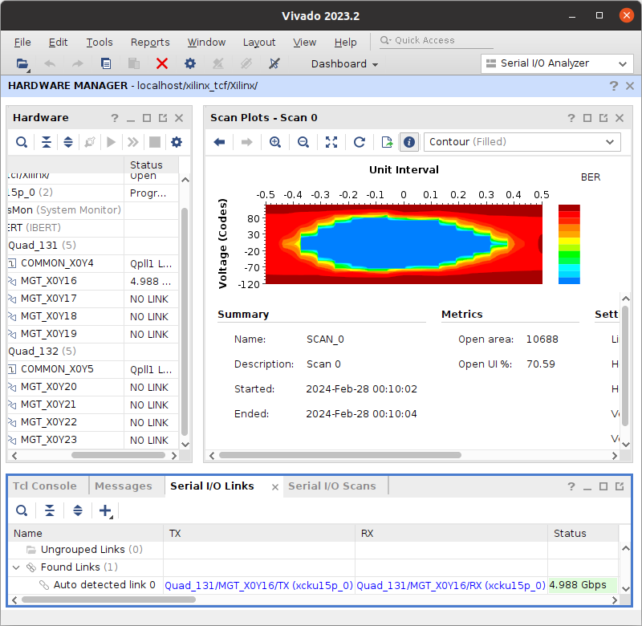
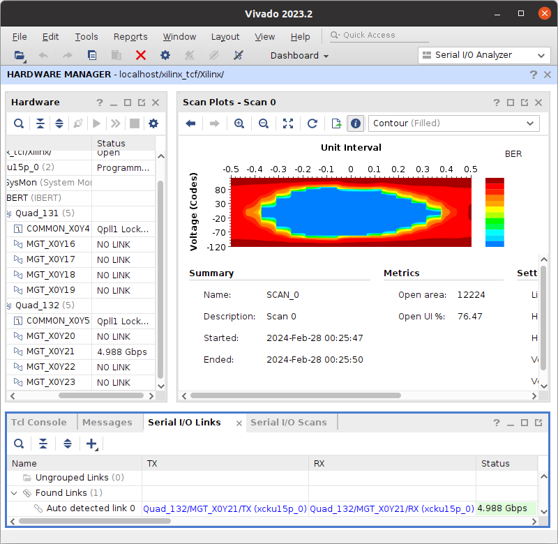
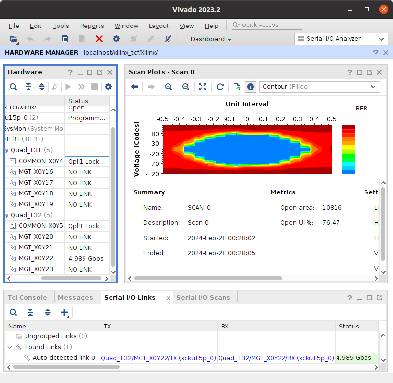
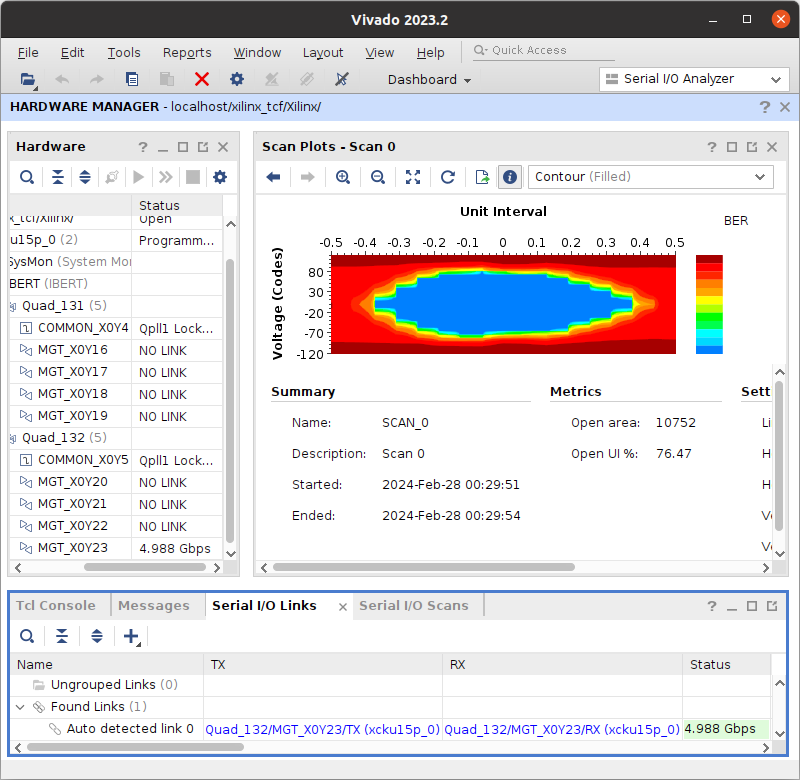
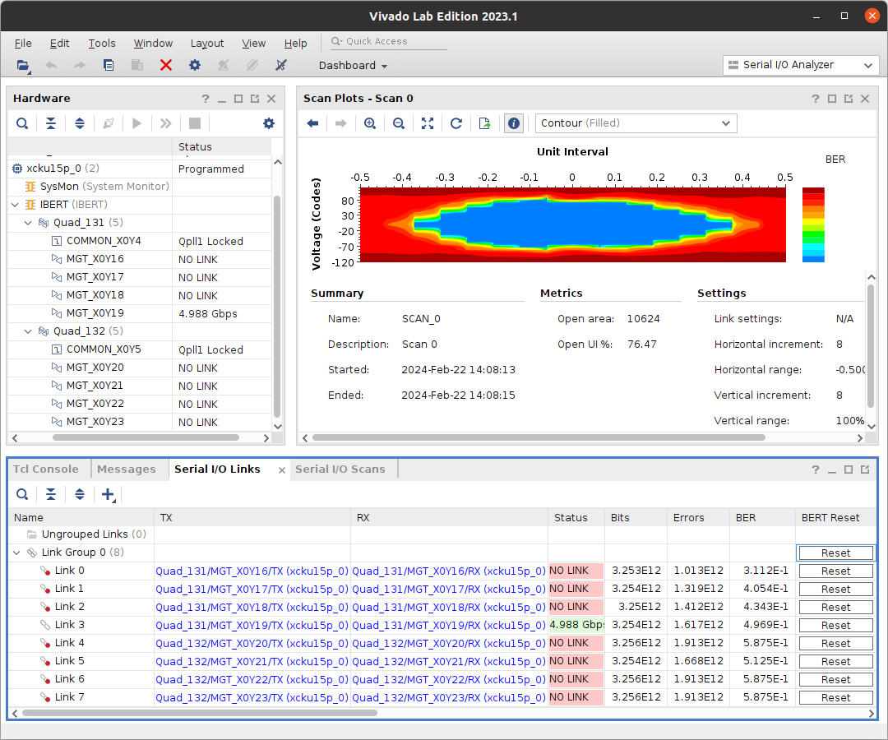
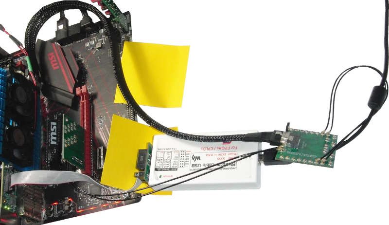
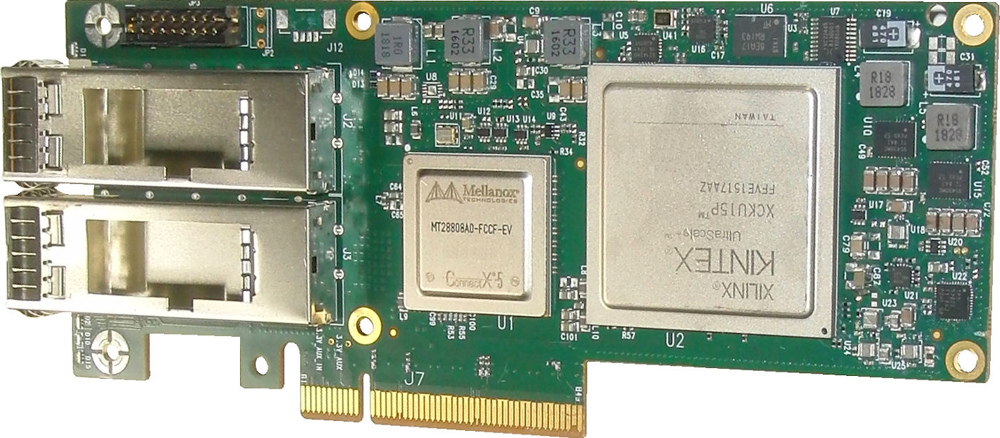

# Innova2 Hardware Notes


## Discerning ADLT vs ADAT and ADIT Variants

[Innova2 8GB MNV303212A-ADLT](https://www.mellanox.com/files/doc-2020/pb-innova-2-flex.pdf) boards have [`MT40A1G16KNR-075`](https://media-www.micron.com/-/media/client/global/documents/products/data-sheet/dram/ddr4/ddr4_16gb_x16_1cs_twindie.pdf) DDR4 ICs with [**D9WFR** FBGA Code](https://www.micron.com/support/tools-and-utilities/fbga?fbga=D9WFR#pnlFBGA). [Innova2 4GB MNV303212A-ADAT/MNV303212A-ADIT](https://network.nvidia.com/pdf/eol/LCR-000437.pdf) boards have [`MT40A512M16JY-083E`](https://media-www.micron.com/-/media/client/global/documents/products/data-sheet/dram/ddr4/8gb_ddr4_sdram.pdf) DDR4 ICs with [**D9TBK** FBGA Code](https://www.micron.com/support/tools-and-utilities/fbga?fbga=D9TBK#pnlFBGA).




## Innova2 4GB MNV303212A-ADIT Hardware Notes


### Testing MNV303212A-ADIT OpenCAPI Connections

A [`v0.1-alpha` **OpenCAPI_Breakout**](https://github.com/mwrnd/OpenCAPI_Breakout/releases/tag/v0.1-alpha) board and the [IBERT for GTY Demo Project](https://github.com/mwrnd/innova2_experiments/tree/main/xcku15p_ffve1517_GTY_IBERT) can be used to test OpenCAPI port connections. Testing works well using a [3M 8ES8-1DF21 Cable](https://www.trustedparts.com/en/search/8ES8-1DF21)([Datasheet](https://multimedia.3m.com/mws/media/1398233O/3m-slimline-twin-ax-assembly-sff-8654-x8-30awg-78-5100-2665-8.pdf)).


The [`v0.1-alpha` **OpenCAPI_Breakout**](https://github.com/mwrnd/OpenCAPI_Breakout/releases/tag/v0.1-alpha) board uses a **Host** version of the OpenCAPI **Carrier** pinout from the [ADM-PCIE-9V5 User Manual (Pg15-19of38)](https://www.alpha-data.com/xml/user_manuals/adm-pcie-9v5%20user%20manual_v1_4.pdf). Labels are relative to the Host. Host RX is Carrier TX and vice versa so the **Rx** pins on the board have transmitter signals from the Add-in card on them. **Tx** pins connect to the Add-in card's receiver signals.


A [PCIe_x8_Breakout](https://github.com/mwrnd/PCIe_x8_Breakout) in a PCIe socket was used as the source for the OpenCAPI 100MHz `GTREFCLK` clock.


Using a multimeter I was able to trace FPGA pin `A33` ([`MGTYTXP3` in Bank 132](https://www.xilinx.com/content/dam/xilinx/support/packagefiles/usapackages/xcku15pffve1517pkg.txt)) to OpenCAPI pin `B23`, and FPGA pin `A34` ([`MGTYTXN3` in Bank 132](https://www.xilinx.com/content/dam/xilinx/support/packagefiles/usapackages/xcku15pffve1517pkg.txt)) to OpenCAPI pin `B24`. A SlimSAS cables swaps rows so these become `A23` and `A24` on the [OpenCAPI_Breakout](https://github.com/mwrnd/OpenCAPI_Breakout/releases/tag/v0.1-alpha). Its U.FL connectors are labeled relative to the Host so **Rx** connectors on the OpenCAPI_Breakout have **Tx** signals from the FPGA on them.


I manually searched for working connections.


After finding working connections I connected both N and P signals.


I discovered that the Innova2 4GB MNV303212A-AD**I**T and Innova2 8GB MNV303212A-AD**L**T have some N-P signals swapped.
```
X0Y16: RX0p-TX0n, RX0n-TX0p <-- N-P swapped
X0Y17: RX1p-TX1p, RX1n-TX1n
X0Y18: RX2p-TX2p, RX2n-TX2n
X0Y19: RX3p-TX3n, RX3n-TX3p <-- N-P swapped
X0Y20: RX4p-TX4n, RX4n-TX4p <-- N-P swapped
X0Y21: RX5p-TX5p, RX5n-TX5n
X0Y22: RX6p-TX6p, RX6n-TX6n
X0Y23: RX7p-TX7p, RX7n-TX7n
```

The following are Eye Diagram Scans for all the OpenCAPI GTY Channels:

`X0Y16 RX0p-TX0n RX0n-TX0p`:



`X0Y17 RX1p-TX1p RX1n-TX1n`:


`X0Y18 RX2p-TX2p RX2n-TX2n`:


`X0Y19 RX3p-TX3n RX3n-TX3p`:


`X0Y20 RX4p-TX4n RX4n-TX4p`:


`X0Y21 RX5p-TX5p RX5n-TX5n`:



`X0Y22 RX6p-TX6p RX6n-TX6n`:



`X0Y23 RX7p-TX7p RX7n-TX7n`:




## Innova2 8GB MNV303212A-ADLT Hardware Notes


### Testing MNV303212A-ADLT OpenCAPI Connections

A [`v0.1-alpha` **OpenCAPI_Breakout**](https://github.com/mwrnd/OpenCAPI_Breakout/releases/tag/v0.1-alpha) board and the [IBERT for GTY Demo Project](https://github.com/mwrnd/innova2_experiments/tree/main/xcku15p_ffve1517_GTY_IBERT) can be used to test OpenCAPI port connections. Testing works well using a [3M 8ES8-1DF21 Cable](https://www.trustedparts.com/en/search/8ES8-1DF21)([Datasheet](https://multimedia.3m.com/mws/media/1398233O/3m-slimline-twin-ax-assembly-sff-8654-x8-30awg-78-5100-2665-8.pdf)).


The [`v0.1-alpha` **OpenCAPI_Breakout**](https://github.com/mwrnd/OpenCAPI_Breakout/releases/tag/v0.1-alpha) board uses a **Host** version of the OpenCAPI **Carrier** pinout from the [ADM-PCIE-9V5 User Manual (Pg15-19of38)](https://www.alpha-data.com/xml/user_manuals/adm-pcie-9v5%20user%20manual_v1_4.pdf). Labels are relative to the Host. Host RX is Carrier TX and vice versa so the **Rx** pins on the board have transmitter signals from the Add-in card on them. **Tx** pins connect to the Add-in card's receiver signals.


A [PCIe_x8_Breakout](https://github.com/mwrnd/PCIe_x8_Breakout) in a PCIe socket was used as the source for the OpenCAPI 100MHz `GTREFCLK` clock.


Using a multimeter I was able to trace FPGA pin `A33` ([`MGTYTXP3` in Bank 132](https://www.xilinx.com/content/dam/xilinx/support/packagefiles/usapackages/xcku15pffve1517pkg.txt)) to OpenCAPI pin `B23`, and FPGA pin `A34` ([`MGTYTXN3` in Bank 132](https://www.xilinx.com/content/dam/xilinx/support/packagefiles/usapackages/xcku15pffve1517pkg.txt)) to OpenCAPI pin `B24`. A SlimSAS cables swaps rows so these become `A23` and `A24` on the [OpenCAPI_Breakout](https://github.com/mwrnd/OpenCAPI_Breakout/releases/tag/v0.1-alpha). Its U.FL connectors are labeled relative to the Host so **Rx** connectors on the OpenCAPI_Breakout have **Tx** signals from the FPGA on them.


I manually searched for working connections.


After finding working connections I connected both N and P signals.


I discovered channels 0, 3, and 4 have swapped transceiver differential pairs (N,P):
```
RX0p-TX0n, RX0n-TX0p <-- N-P swapped
RX1p-TX1p, RX1n-TX1n
RX2p-TX2p, RX2n-TX2n
RX3p-TX3n, RX3n-TX3p <-- N-P swapped
RX4p-TX4n, RX4n-TX4p <-- N-P swapped
RX5p-TX5p, RX5n-TX5n
RX6p-TX6p, RX6n-TX6n
RX7p-TX7p, RX7n-TX7n
```

The following are Eye Diagram Scans for all the OpenCAPI GTY Channels:

`X0Y16 RX0p-TX0n RX0n-TX0p`:


`X0Y17 RX1p-TX1p RX1n-TX1n`:


`X0Y18 RX2p-TX2p RX2n-TX2n`:


`X0Y19 RX3p-TX3n RX3n-TX3p`:



`X0Y20 RX4p-TX4n RX4n-TX4p`:


`X0Y21 RX5p-TX5p RX5n-TX5n`:


`X0Y22 RX6p-TX6p RX6n-TX6n`:


`X0Y23 RX7p-TX7p RX7n-TX7n`:


After about 15 minutes Channel X0Y19 began failing due to overheating:


Using an SFPCables SlimSAS cable:



Results are much worse for each channel:


The PLL loses lock.


## Innova2 MNV303212A-ADIT Hardware Notes

The `MNV303611A-EDLT` has dual 100Gbps QSFP ports but no DDR4 memory or OpenCAPI connector.




